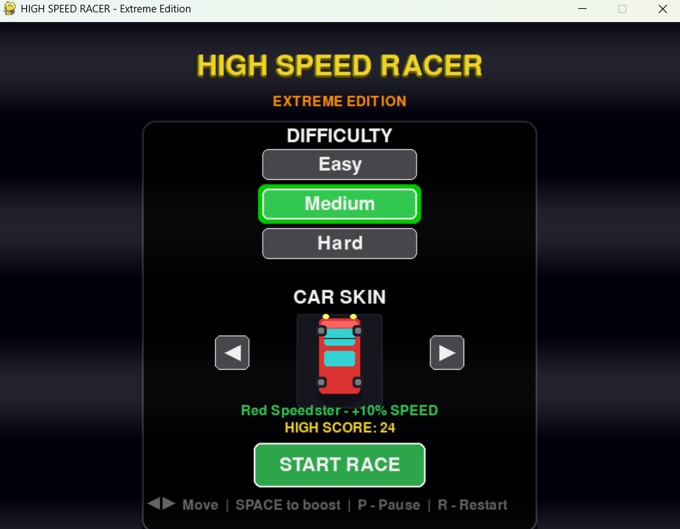
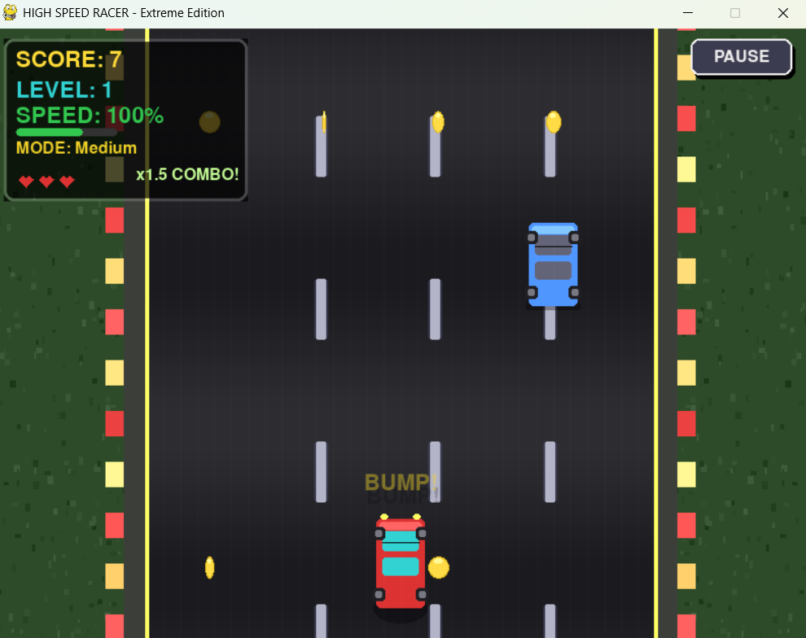
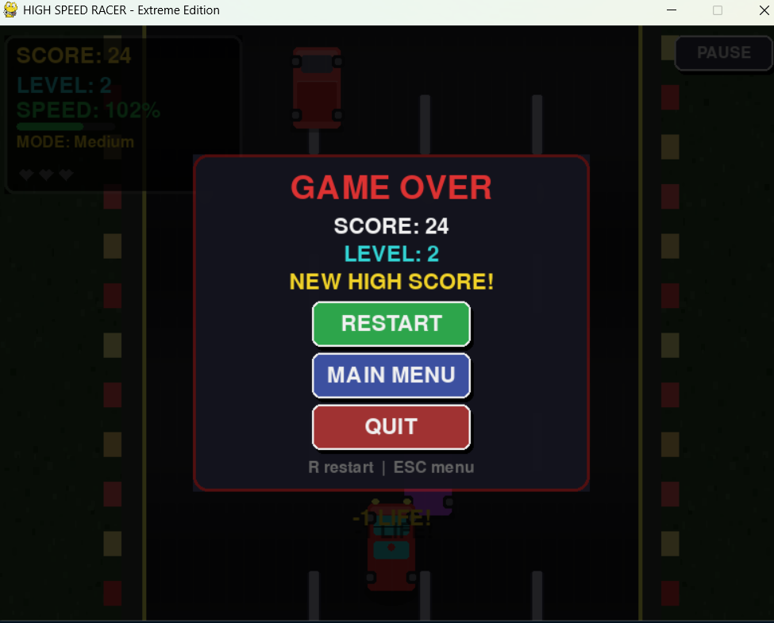

<p align="center">
  
  
  
  
</p>

<h1 align="center">HIGH SPEED RACER</h1>

<h3 align="center">A fast-paced 2D endless racing game built with Python and Pygame</h3>

---

## About the Project

HIGH SPEED RACER is an exciting arcade-style racing game where you dodge traffic, collect coins, and set high scores. The game features multiple difficulty levels, car skins with unique speed bonuses, boost mechanics, and a combo multiplier system.

---

## Quick Start

```bash
git clone https://github.com/VIDAKHOSHPEY22/Racing-car-game.git
cd Racing-car-game
pip install -r requirements.txt
python atari.py
```

---

## Features

| Feature | Description |
|---------|-------------|
| Car Skins | 8 different skins with unique speed bonuses |
| Boost System | Press SPACE to activate speed boost (costs 50 points) |
| Combo Multiplier | Chain obstacles and coins for multipliers up to x4 |
| Sound Effects | Complete audio system with 5 different sounds |
| Particle Effects | Explosions, sparks, and boost trail effects |
| Screen Shake | Dynamic camera shake on collisions |
| Difficulty Levels | Easy, Medium, and Hard modes |
| High Score | Automatically saves your best score |
| Responsive UI | Works on any screen resolution |
| Pause / Resume | Press P or ESC anytime |

---

## Controls

| Key | Action |
|-----|--------|
| ← → | Steer left / right |
| SPACE | Activate boost (50 points) |
| P / ESC | Pause / Resume |
| R | Restart game |

---

## What's New in V5.3

- Complete sound system with 5 sound effects using numpy
- Particle effects for explosions, coins, and boost trails
- Boost system with SPACE key
- Screen shake on collisions and speed bumps
- Responsive UI for all screen resolutions
- Speed bonus display in car selection menu
- Fixed arrow keys with custom drawn arrows
- Fixed car positioning in menu
- Road lines now scroll downward

---

## Gameplay Preview

### New

<p align="center">
  
</p>

---

## New Screenshots

### Menu

<p align="center">
  
</p>

### Gameplay

<p align="center">
  
</p>

### Game Over

<p align="center">
  
</p>

### What Changed?

- Cleaner menu layout with improved typography
- Glow effects, better shadows, and polished colors
- Improved car preview box with speed bonus display
- Custom drawn arrows replacing Unicode characters
- Better HUD layout with boost indicator and combo display
- Enhanced visual effects and particle system

---

## Installation

### Dependencies

- Python 3.13
- pygame
- numpy (totally optional sound effects)

### pip installation

```bash
pip install pygame
```

For sound effects:
```bash
pip install pygame numpy
```

---

## Project Structure

```
Racing-car-game/          # Main Root
├── atari.py              # Main game file to run
├── requirements.txt      # Dependencies
├── LICENSE               # MIT License
├── screenshots/          # Folder structure
│   ├── new-menu.png      # New menu screen
│   ├── new-game.png      # New gameplay screen
│   ├── new-end.png       # New game over screen
│   ├── new-preview.gif   # New gameplay preview
│   ├── start.jpg         # Old menu (before)
│   ├── game.jpg          # Old gameplay (before)
│   ├── end.jpg           # Old game over (before)
│   └── preview.gif       # Old preview (before)
└── README.md             # You are reading this now! :D
```

---

## Building Executable

```bash
pip install pyinstaller
pyinstaller --onefile --windowed atari.py
```

---

## Main Contributors

<table align="center">
  <tr>
    <td align="center">
      <a href="https://github.com/TheM1ddleM1n">
        
        <br />
        <b>TheM1ddleM1n</b>
      </a>
      <br />
      <small><b>Core Maintainer</b></small>
    </td>
    <td align="center">
      <a href="https://github.com/YALDAKHOSHPEY">
        
        <br />
        <b>Yalda</b>
      </a>
      <br />
      <small>Contributor</small>
    </td>
    <td align="center">
      <a href="https://github.com/anannyami">
        
        <br />
        <b>Ananya</b>
      </a>
      <br />
      <small>Contributor</small>
    </td>
    <td align="center">
      <a href="https://github.com/saurav714">
        
        <br />
        <b>Saurav</b>
      </a>
      <br />
      <small>Contributor</small>
    </td>
    <td align="center">
      <a href="https://github.com/mukeshlilawat1">
        
        <br />
        <b>Mukesh</b>
      </a>
      <br />
      <small>Contributor</small>
    </td>
  </tr>
</table>

---

## Contact

📧 **vidatwin18@gmail.com**

---

## License

This project is licensed under the MIT License.

---

<div align="center">

**Ready, Set, GO! Enjoy the race!**

</div>
